# Consumer Configuration

# This software is in PRE-Alpha state and should not yet be deployed.

## Table of Contents

   * [Overview](#overview)
   * [Email](#email)
   * [Testing Email](#testingemail)
   * [IFTTT](#ifttt)
   * [Editing for IFTTT Server](#editingforiftttserver)
   * [Configuring Users for Email and IFTTT](#configuringusersforemailandifttt)
   * [Help](#help)
   * [Copyright](#copyright)
   * [License](#license)
   * [Trademarks](#trademarks)
   * [Contributors](#contributors)

## Overview

Consumers are processes that accept messages from Alerts through the Exchange. It is envisioned that
there will be many different consumers. This documentation will outline the configuration of the two working consumers; email and ifttt.

## Email

### Directory Structure

You should be in the ```config``` directory and looking at the following subdirectories:

```
drwxr-xr-x  12 someone  somegroup  384 Aug  4 13:09 consumer
drwxr-xr-x   7 someone  somegroup  224 Aug  4 13:09 alerts
```

Let's start by editing the files in the ```consumer``` subdirectory. 

```cd consumer```

You should see:

```
-rw-r--r--  1 someone  somegroup   208 Aug  3 17:06 QumuloEmailServer.json
-rw-r--r--  1 someone  somegroup   849 Aug  3 17:06 QumuloEmailServer.schema.json
-rw-r--r--  1 someone  somegroup   226 Aug 10 11:13 QumuloExchangeEMail.json
-rw-r--r--  1 someone  somegroup   740 Aug  3 17:06 QumuloExchangeEMail.schema.json
-rw-r--r--  1 someone  somegroup   226 Aug 10 11:13 QumuloExchangeIFTTT.json
-rw-r--r--  1 someone  somegroup   740 Aug  3 17:06 QumuloExchangeIFTTT.schema.json
-rw-r--r--  1 someone  somegroup   118 Aug  3 17:06 QumuloIFTTTServer.json
-rw-r--r--  1 someone  somegroup   490 Aug  3 17:06 QumuloIFTTTServer.schema.json
-rw-r--r--  1 someone  somegroup  1050 Aug 10 11:13 QumuloUsers.json
-rw-r--r--  1 someone  somegroup  1472 Aug  3 17:06 QumuloUsers.schema.json
```

### QumuloEmailServer json file

If this file is not configured or configured improperly, then the email docker container will halt. It is entirely
optional to configure email. If your organization wants to only use IFTTT (SMS), then you can skip this section.

If, however, you wish to send emails, then you need to configure the following entry properly. And, more importantly,
you need to verify the successful operation of the email server through the email relay.

If you wish to configure email, let's get started by editing the file ```QumuloEmailServer.json``` using your favorite text based editor.

Once you have it open in the editor, you should see the following:

```
{
    "from_addr": "",
    "to_addr": "",
    "login": "",
    "password": "",
    "server": "smtp.gmail.com",
    "port": 465,
    "use": "ssl",
    "default_language": "en_GB",
    "default_timezone": "UTC"
}
```

   - `from_addr` - FROM email address
   - `to_addr` - TO email address **(used ONLY to test the email server)**
   - `login` - Username needed to login to the email server
   - `password` - Password needed to login to the email server
   - `server` - FQDN or IP address of the email server
   - `port` - TCP port needed to communicate with the email server
   - `use` - Either `ssl` or `tls`
   - `default_language` - Language to be used for translation (see below)
   - `detault_timezone` - Timezone to be used for date time messages

### Language Definitions

Both the EMail server and the IFTTT server will translate messages into your native language. 

The currently supported languages and their codes are:

| Language Code | Description                           |
|---------------|---------------------------------------|
| de_AT         | German Language - Austria             |
| de_CH         | German Language - Switzerland         |
| de_DE         | German Language - Germany             |
| en_GB         | English Language - Great Britain      |
| en_US         | English Language - USA                |
| es_ES         | Spanish Language - Spain              |
| fr_BE         | French Language - Belgium             |
| fr_CA         | French Language - Canada              |
| fr_FR         | French Language - France              |
| it_IT         | Italian Language - Italy              |
| ja_JP         | Japanese Language - Japan             |
| ko_KR         | Korean Language - Korea               |
| pl_PL         | Polish Language - Poland              |
| tr_TR         | Turkish Language - Turkey             |
| zh_TW         | Traditional Chinese Language - Taiwan |

### Timezones

Timezones are used when messages are translated and output to the user. Each message received from the alerts process through the exchange
has a timestamp on it. That timestamp is in UTC time and will need to be changed to match the timezone of the recipient.

The software utilizes the standard TZ database format of **Continent/City**. Example: **America/Phoenix**.

For a detailed listing, look at the following article:

[Database of TZ timezones](https://en.wikipedia.org/wiki/List_of_tz_database_time_zones)

If you do not define a timezone for the **default_timezone** in the Email Server configuration file, then it is assumed that **UTC** will be used.
UTC, by the way, is the only timezone that does not follow the format of **Continent/City**.

### Corrected edited QumuloEmailServer.json file

```
{
    "from_addr": "admin@xyzcorp.com",
    "to_addr": "joe@xyzcorp.com",
    "login": "admin@xyzcorp.com",
    "password": "ThisisMyPassword$!@",
    "server": "smtp.xyzcorp.com",
    "port": 587,
    "use": "ssl",
    "default_language": "en_GB",
    "default_timezone": "UTC"
}
```

1. The **from_addr** will be used in every message from the email server. It signifies to the email recipient the address that sent the email. This should be something that will readily identify why the email recipient is receiving this email.
2. The **to_addr** is **ONLY** used to test the email server. The actual **to_addr* comes from the **QumuloUsers.json** file that is described later in this document.
3. The **login** is required by many email relays to verify that the email sender is not trying to utilize the email service to send bulk email. Many organizations place their email behind firewalls and remove the need for the login and password. Verify with your email administration what is required to send email through your organizations email relay.
4. The **password** is required, along with the login, by many email relays.
5. The **server** is the actual address of the STMP email relay. 
6. The **port** is the port required by SMTP email relay. In most cases, it will be 587 for SSL and/or TLS. In some rare cases, some organizations still use 25.
7. The **use** field specifies whether your SMTP email relay requires either SSL or TLS encryption.
8. The **default_language** specifies the language that should be used to translate each of the messages. This can be overriden by individual users; specified in the **QumuloUsers.json** file that is described later.
9. The **default_timezone** specifies the timezone used to output the messages. Each event that occurs within Alerts is encoded with a timestamp based upon the UTC timezone. But, humans like to see time messages based upon their location. This field, like **default_language** can be overriden by individual users in the **QumuloUsers.json** file that is described later.

#### Optional Email fields

The fields **login**, **password**, and **use** are entirely optional based upon your email relay service. If your organization utilizes a simple SMTP relay behind a firewall, it is entirely possible that you do not have to login. So, it is safe (in those cases) to remove the login, password, and use fields.

### A note about using gmail as a relay

As of the end of May 2022, only organizations with access to the Google Admin Console can utilize the SMTP relay.
If your organization has that access, then you need to configure it using these instructions:

[Using Google as an SMTP relay](https://support.google.com/a/answer/2956491?hl=en)

## Testing Email

Before you continue, you should test to see if your configuration entry for email will work with your email system.
We have made this easy for you by including an email test program that will read your configuration file and send
a test email.

In the QumuloAlerts directory, you will find two versions of the test_email program. These are compiled
versions of the same program for the architectures: `macos-latest` and `ubuntu-latest`. 

Before you run any of these programs, you should verify that you have execute permissions. This needs to be done because the process of executing
"git clone" to download this software does not guarantee that permissions are preserved. 

Set the execute permissions for either Linux or MacOS with the command:

`chmod a+x test_email.macos-latest (or test_email.ubuntu-latest)`

Now, find the program based upon your architecture and run it by typing `./test_email.ARCHITECTURE --config ./config/consumer/` in a
terminal window. If there are no errors, a test email should be sent to the **to_addr** in your config file.

## IFTTT

You’ve no doubt heard of software as a service. Those who are deeply into IT will nod their heads in recognition when acronyms such as IaaS (infrastructure as a service) and PaaS (platform as a service) are tossed around, too. 
But here’s one “*aaS” you might not have heard of yet: **everything as a service**. 

### What is IFTTT

IFTTT derives its name from the programming conditional statement “if this, then that.” What the company provides is a software platform that connects apps, devices and services from different developers in order to trigger one or more automations involving those apps, devices and services.

These applets are often referred to as "WebHooks".

With IFTTT, you define applets and trigger them via a simple HTTP message (hence the nickname **webhook**). A webhook is nothing more than a HTTP message to "fire off" or trigger an applet.

Here are just three **if this, then** applets as examples:

* If you make a call on your Android phone, then a log of that call is added to a Google spreadsheet.

* If you add a new task to your Amazon Alexa to-dos, then it will be added to your iOS Reminders app.

* If the International Space Station passes over your house, then you’ll get a smartphone notification about it. (Yes, this is an actual IFTTT applet.)

### IFTTT triggers and fields

With IFTTT, an application triggers a webhook with a trigger name (such as "send_sms"). The definition of the trigger name is entirely up to the person creating the applet in IFTTT.
Passed along with the trigger name are one or more fields called **values**.

### Using IFTTT to send an SMS message

The best way to demonstrate how this works is to create an IFTTT applet to trigger an SMS message.

1. http://www.ifttt.com
2. Create an acccount

During the account creation process, you will receive a token that will be used to communicate with the service. This token is given out once, so you will need to remember it. The token is required later when we configure the IFTTT Server for QumuloAlerts. 

On the main screen and after you create an account and login, you will see the following:

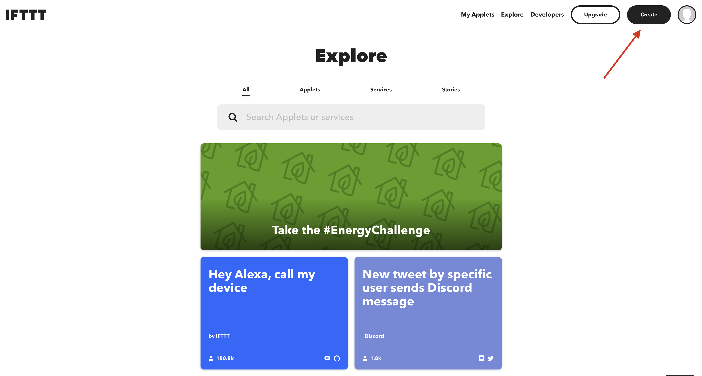

Click on the **Create** button.

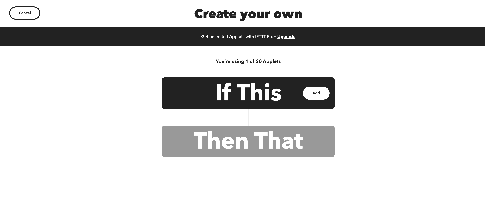

Click the **Add** button under **If This**

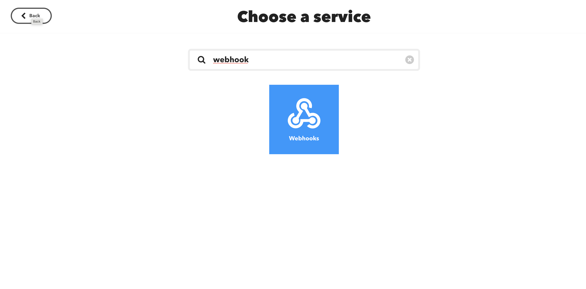

Type in **webhook** under the search bar. Then, click on **Webhooks**. 

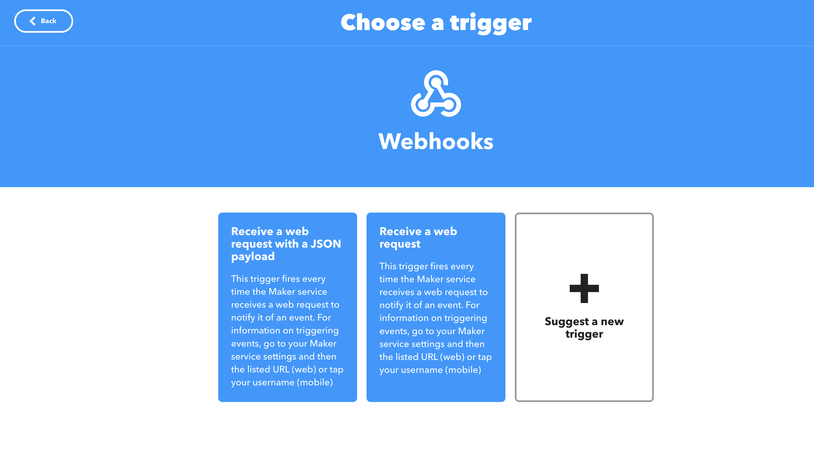

Click on **Receive a web request**

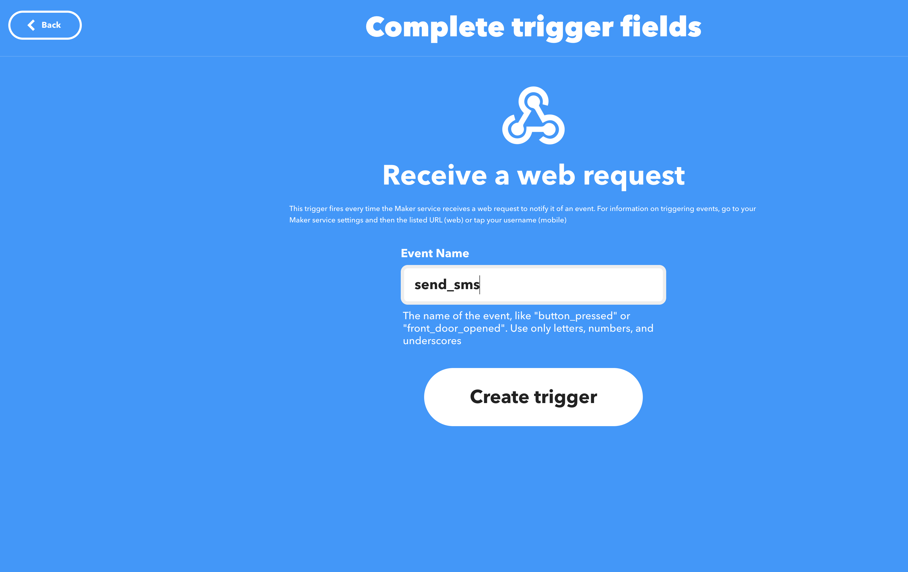

Type in some **Event Name** (and remember it please). You can see that we used **send_sms**. Whatever your event name is, it must be one word without spaces. Special characters like "_" or "-" are ok. Then, click **Create Trigger**

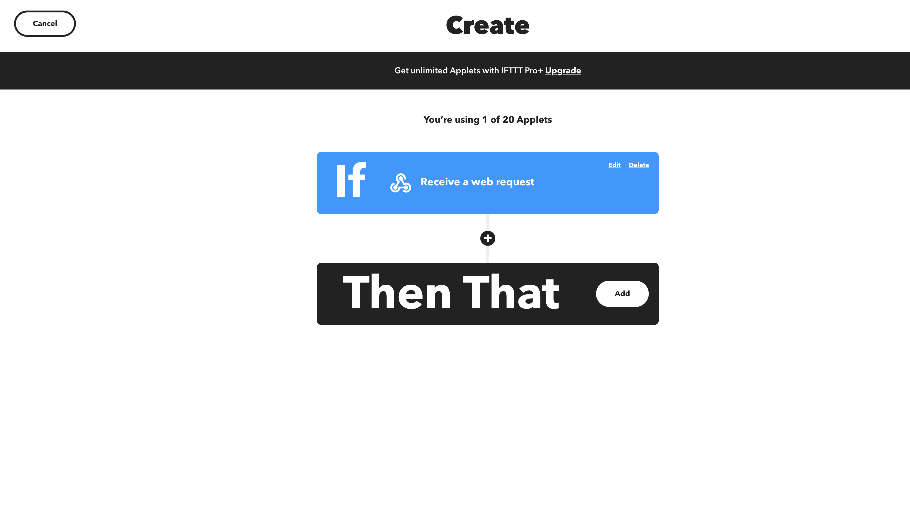

You should now see the above screen. Next, you will define what happens after the HTTP webhook is received.
So, click **Add** under **Then That**

When you get to the next screen, you will see **MANY** different services that can be selected. We are going to make this simple and only look for ones that can provide SMS. So, type **sms** into the search bar.

What you should see is the following screen.

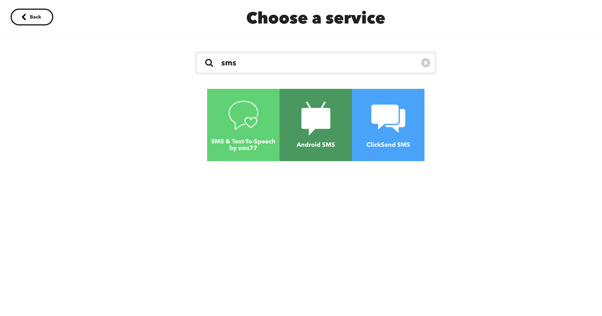

Depending upon where you live, you may see different options. All of these are Paid-For services. It will be fairly impossible not to Pay for these types of services since SMS must ultimately go through some mobile provider. Each of these providers will charge you something for sending your SMS messages.

The one that we like is **ClickSend SMS** because they work for both Android and iPhones and the cost per SMS is about $.02 (USA Dollars). 

If you choose to use **sms77** or **ClickSend SMS**, then you will need to create accounts with them before you can continue to the next step.
For this example, we are going to assume you select **ClickSend SMS** and show you the configuration for that.

So, click the **ClickSend SMS** button.

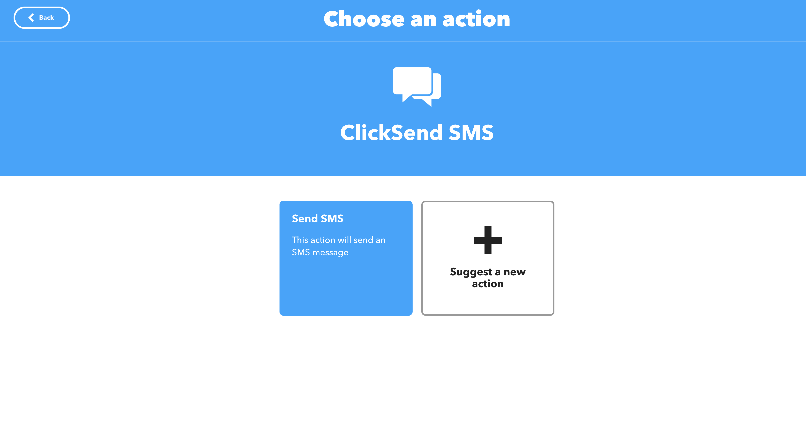

Now, click the **Send SMS** button

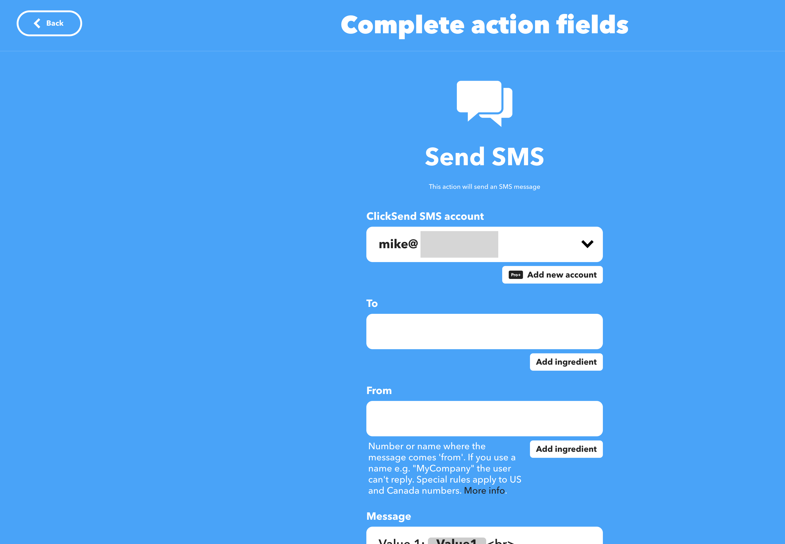

The **ClickSend SMS account** should be filled in. As you can see, we have a blurred account name in the field with **mike@**... It doesn't matter what the account name is as long as it matches what you signed up for when you created your ClickSend SMS account.

The next field is the **To**. This is one of those fields that is absolutely required to be formatted properly for QumuloAlerts to send proper SMS messages.
So, click on the **Add Ingredient** button. You should see:

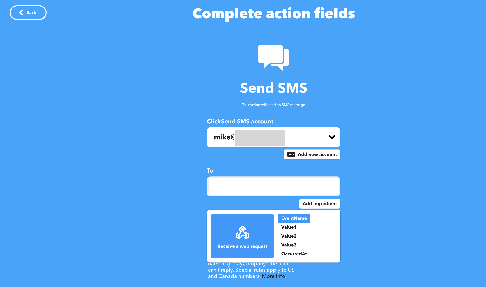

The only thing that we allow in this field is **Value1**. When we send the SMS request from QumuloAlerts, we will send a **Value1=User Phone Number** along with the trigger. 
So, click on the **Value1** in the ingredients panel. You will see:

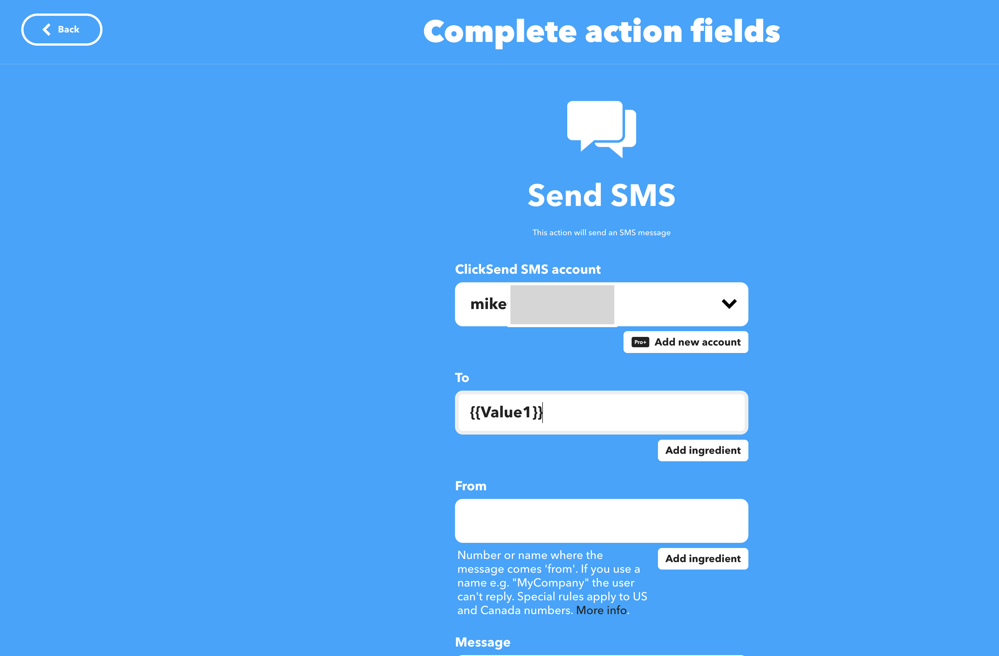

The next field that you need to fill in is the **From**. This is the phone number that is assigned to you by ClickSend SMS. This phone number is unique and only works with the ClickSend SMS service under the ClickSend SMS account that you created. It cannot be used anywhere else and is **REQUIRED** for this service to work.
For this example, we have displayed an example number that is not valid so that you can see what it looks like.

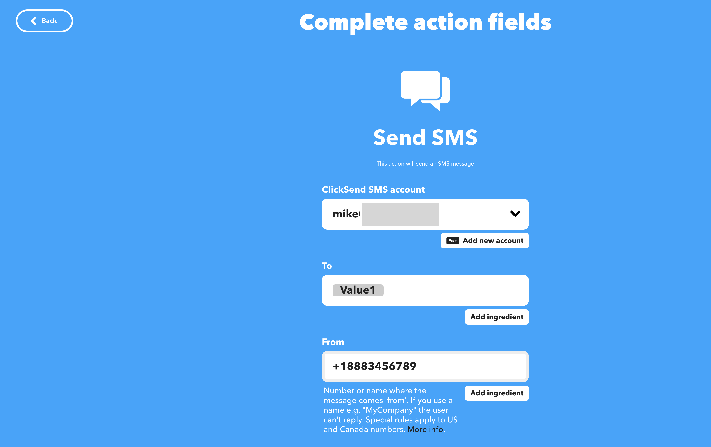

Finally, we need to create the ingredient for the **Message** field. So, click the **Add Ingredient** button next to the **Message** field. It should look like:

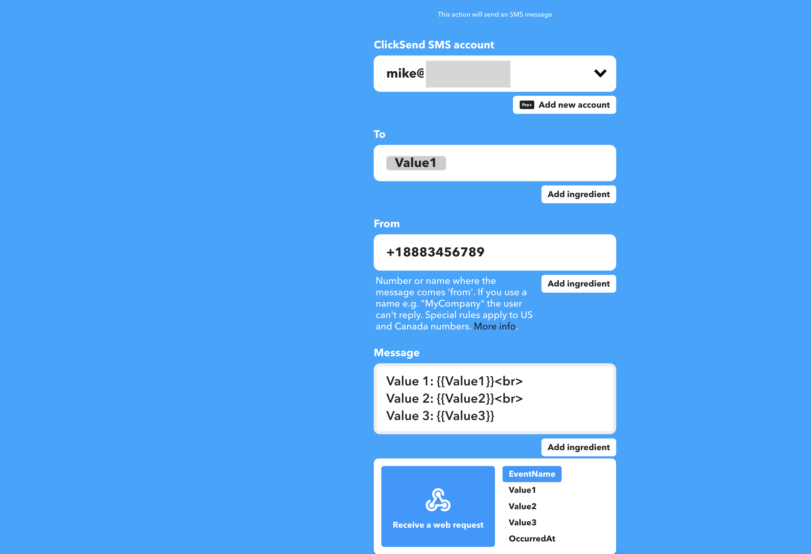

First, clear everything already in the message field that looks like **Value1:{{Value1}}**, etc by selecting all of the text and hitting the delete or backspace key on your keyboard.

Next, click on **Value2**. What you should see after you are done is:

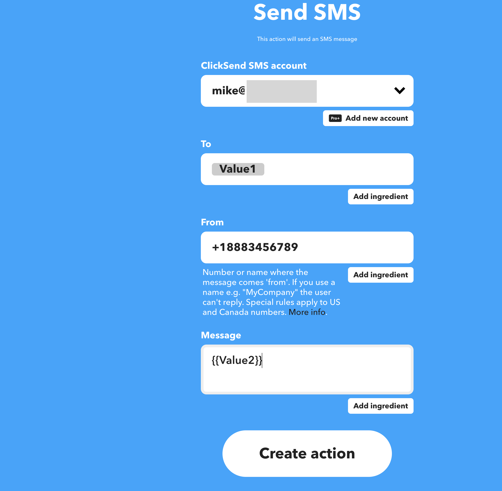

Finally, click the **Create Action** button. That is it!! You have created a webhook that will work for sending SMS messages.

## Editing for IFTTT Server

Now that you have a IFTTT account, you can edit the **QumuloIFTTTServer.json** configuration file. This file
is necessary in order for the QumuloAlerts software to know how to communicate with the IFTTT service that you just configured.

Let's start by going to the location of the configuration files. From earlier, the location is ```./config/consumer/```

You should see:

```
-rw-r--r--  1 someone  somegroup   208 Aug  3 17:06 QumuloEmailServer.json
-rw-r--r--  1 someone  somegroup   849 Aug  3 17:06 QumuloEmailServer.schema.json
-rw-r--r--  1 someone  somegroup   226 Aug 10 11:13 QumuloExchangeEMail.json
-rw-r--r--  1 someone  somegroup   740 Aug  3 17:06 QumuloExchangeEMail.schema.json
-rw-r--r--  1 someone  somegroup   226 Aug 10 11:13 QumuloExchangeIFTTT.json
-rw-r--r--  1 someone  somegroup   740 Aug  3 17:06 QumuloExchangeIFTTT.schema.json
-rw-r--r--  1 someone  somegroup   118 Aug  3 17:06 QumuloIFTTTServer.json
-rw-r--r--  1 someone  somegroup   490 Aug  3 17:06 QumuloIFTTTServer.schema.json
-rw-r--r--  1 someone  somegroup  1050 Aug 10 11:13 QumuloUsers.json
-rw-r--r--  1 someone  somegroup  1472 Aug  3 17:06 QumuloUsers.schema.json
```

### QumuloIFTTTServer json file

If this file is not configured or configured improperly, then the ifttt docker container will halt. It is entirely
optional to configure ifttt. If your organization wants to only use Email, then you can skip this section.

If, however, you wish to send sms messages or trigger other webhooks, then you need to configure the following entry properly. 

If you wish to configure ifttt, let's get started by editing the file ```QumuloIFTTTServer.json``` using your favorite text based editor.

Once you have it open in the editor, you should see the following:

```
{
    "token": "",
    "trigger_action": "send_sms",
    "default_language": "en_GB",
    "default_timezone": "UTC"
}
```

   - `token` - This is the token necessary to login to the IFTTT Server. You got this token when you created your account in IFTTT.com
   - `trigger_action` - This is the name of the action that we created above
   - `default_language` - Language to be used for translation (see below)
   - `detault_timezone` - Timezone to be used for date time messages

The default_language and default_timezone were rather exhaustively discussed during the email configuration above. If you need
a refresher, you can go back and look at them by following either link.

[Language Definitions](#languagedefinitions)

[Timezones](#timezones)

Once you have completed editing the file, the contents of the file should look like:

```
{
    "token": "xyz12fjd8rjF9SD",
    "trigger_action": "send_sms",
    "default_language": "en_GB",
    "default_timezone": "UTC"
}
```

Of course, the token above is not real and is strictly for example purposes. 

## Configuring Users for Email and IFTTT

In the ```./config/consumer/``` directory, you will find a **QumuloUsers.json** file. That is the main file used to configure users and what events they will subscribe to for email and/or IFTTT messages.

As a reminder, the directory contains:

```
-rw-r--r--  1 someone  somegroup   208 Aug  3 17:06 QumuloEmailServer.json
-rw-r--r--  1 someone  somegroup   849 Aug  3 17:06 QumuloEmailServer.schema.json
-rw-r--r--  1 someone  somegroup   226 Aug 10 11:13 QumuloExchangeEMail.json
-rw-r--r--  1 someone  somegroup   740 Aug  3 17:06 QumuloExchangeEMail.schema.json
-rw-r--r--  1 someone  somegroup   226 Aug 10 11:13 QumuloExchangeIFTTT.json
-rw-r--r--  1 someone  somegroup   740 Aug  3 17:06 QumuloExchangeIFTTT.schema.json
-rw-r--r--  1 someone  somegroup   118 Aug  3 17:06 QumuloIFTTTServer.json
-rw-r--r--  1 someone  somegroup   490 Aug  3 17:06 QumuloIFTTTServer.schema.json
-rw-r--r--  1 someone  somegroup  1050 Aug 10 11:13 QumuloUsers.json
-rw-r--r--  1 someone  somegroup  1472 Aug  3 17:06 QumuloUsers.schema.json
```

Let's look at the contents of the file.

```angular2html
[
    {
        "full_name": "Joe Schmo",
        "short_name": "Joe",
        "email_address": "joe@anywhere.com",
        "language": "en_US",
        "timezone": "America/Phoenix",
        "notify":
        [
            {
                "category": "Alarms",
                "subcategory": ["Disks", "Nodes"],
                "enabled": true
            }
        ]
    },
    {
        "full_name": "Amy Iknow",
        "short_name": "amy",
        "email_address": "amy@anywho.com",
        "phone_number": "+9041396742005"
        "language": "tr_TR",
        "timezone": "Europe/Istanbul",
        "notify":
        [
            {
                "category": "Alarms",
                "subcategory": ["*"],
                "enabled": true
            },
            {
                "category": "Alerts",
                "subcategory": ["Quotas"],
                "enabled": true
            },
            {
                "category": "Informational",
                "subcategory": ["*"],
                "enabled": false
            }
        ]
    }
]
```

The configuration file is an array of User entries. In the example above, there are two entries. Let's go through them in a little more detail.

1. ```full_name``` - Joe Schmo (Of course, this would be the name of whoever should receive the message)
2. ```short_name``` - Joe
3. ```email_address``` - joe@anywhere.com (This is an optional field. If it doesn't exist, then an email will not be sent for this user)
4. ```language``` - en_US (English - USA)
5. ```timezone``` - America/Phoenix
6. ```notify``` - This is an array of notifications that Joe Schmo wants to subscribe to. If the notification is not in the array, then any notification sent from QumuloAlerts will not be sent to this user.

As stated above, the notify section is composed of one or more array items that the user wants to subscribe to.
Let's look at the one item for Joe Schmo.

1. ```category``` - This must be one of **Alarms**, **Alerts**, or **Informational**
2. ```subcategory``` - This is an array of items that correspond to the plugins used in QumuloAlerts. In the example above, Joe Schmo wants to subscribe to **Disks** and **Nodes**. This corresponds to Alarms of Disk and Node failures (or state changes).
3. ```enabled``` - In this example, it is **true**. If the entry is **false**, then Joe Schmo will not receive any Alarms for Disks or Nodes.

**NOTE**: using a "*" within the subcategory specifies that **ALL** plugins for this category should be subscribed to.

**NOTE**: Do not forget the comma between any items in an array. Notice between Joe Schmo and Amy Iknow above that there is a comma between their entries. The last entry within an array has no comma. The same is true of the **notify** array for Amy Iknow. In that array, there are three entries: **Alarms**, **Alerts**, and **informational**. There is a comma between **Alarms** and **Alerts** and between **Alerts** and **Informational**
## Help

To post feedback, submit feature ideas, or report bugs, use the [Issues](https://github.com/Qumulo/QumuloAlerts/issues) section of this GitHub repo.

## Copyright

Copyright © 2022 [Qumulo, Inc.](https://qumulo.com)

## License

[](https://opensource.org/licenses/MIT)

See [LICENSE](LICENSE) for full details

    MIT License
    
    Copyright (c) 2022 Qumulo, Inc.
    
    Permission is hereby granted, free of charge, to any person obtaining a copy
    of this software and associated documentation files (the "Software"), to deal
    in the Software without restriction, including without limitation the rights
    to use, copy, modify, merge, publish, distribute, sublicense, and/or sell
    copies of the Software, and to permit persons to whom the Software is
    furnished to do so, subject to the following conditions:
    
    The above copyright notice and this permission notice shall be included in all
    copies or substantial portions of the Software.
    
    THE SOFTWARE IS PROVIDED "AS IS", WITHOUT WARRANTY OF ANY KIND, EXPRESS OR
    IMPLIED, INCLUDING BUT NOT LIMITED TO THE WARRANTIES OF MERCHANTABILITY,
    FITNESS FOR A PARTICULAR PURPOSE AND NONINFRINGEMENT. IN NO EVENT SHALL THE
    AUTHORS OR COPYRIGHT HOLDERS BE LIABLE FOR ANY CLAIM, DAMAGES OR OTHER
    LIABILITY, WHETHER IN AN ACTION OF CONTRACT, TORT OR OTHERWISE, ARISING FROM,
    OUT OF OR IN CONNECTION WITH THE SOFTWARE OR THE USE OR OTHER DEALINGS IN THE
    SOFTWARE.

## Trademarks

All other trademarks referenced herein are the property of their respective owners.

## Contributors

 - [Berat Ulualan](https://github.com/beratulualan)
 - [Michael Kade](https://github.com/mikekade)
