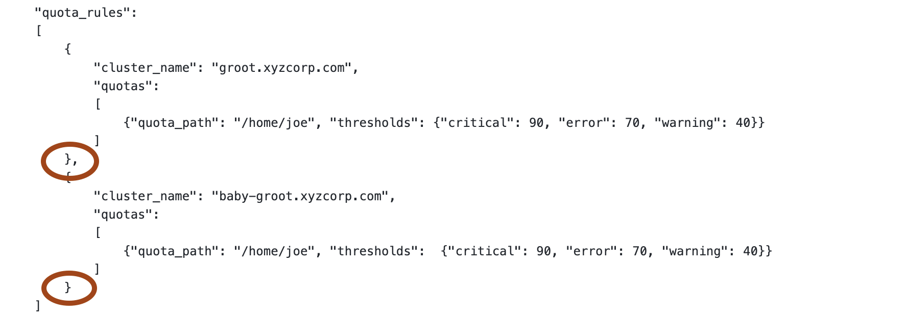

# QumuloAlerts Configuration

# This software is in PRE-Alpha state and should not yet be deployed.

## Table of Contents

   * [Directory Structure](#directorystructure)
   * [QumuloAlerts json file](#qumuloalertsjsonfile)
   * [Plugin Configuration](#pluginconfiguration)
   * [Help](#help)
   * [Copyright](#copyright)
   * [License](#license)
   * [Trademarks](#trademarks)
   * [Contributors](#contributors)

## Directory Structure

You should be in the ```config``` directory and looking at the following subdirectories:

```
drwxr-xr-x  12 someone  somegroup  384 Aug  4 13:09 consumer
drwxr-xr-x   7 someone  somegroup  224 Aug  4 13:09 alerts
```

Let's start by editing the files in the ```alerts``` subdirectory. 

```cd alerts```

You should see:

```
-rw-r--r--  1 someone  somegroup   638 Aug  2 13:23 QumuloAlerts.json
-rw-r--r--  1 someone  somegroup  2541 Aug  2 13:23 QumuloAlerts.schema.json
-rw-r--r--  1 someone  somegroup   204 Aug  4 13:09 QumuloExchange.json
-rw-r--r--  1 someone  somegroup   614 Aug  2 13:23 QumuloExchange.schema.json
drwxr-xr-x  4 someone  somegroup   128 Aug  3 17:06 plugins
```

## QumuloAlerts json file

Using your favorite editor, edit the file ```QumuloAlerts.json```. This file contains one or more json structures; one for each cluster that you wish to monitor. 

Let's look at the structure of one cluster.

```
[
    {
        "cluster_name": "cluster_1.qumulo.com",
        "cluster_port": 8000,
        "cluster_username": "USERNAME",
        "cluster_password": "PASSWORD",
        "nlb": false,
        "frequency": {
            "seconds": 30
        },
        "monitor": [
            {
                "category": "Alarms",
                "subcategory": ["Disk", "Node"],
                "enabled": true
            }
        ]
    }
]
```

There are three main sections within this configuration: The cluster, the frequency used to monitor the cluster, and what to monitor within the cluster.

1. Cluster Information
  
   - `cluster_name` - FQDN or IP address of the cluster to monitor.
   - `cluster_port` - The TCP port on which to access the cluster. The default is 8000.
   - `cluster_username` - Username needed to login to the cluster.
   - `cluster_password` - Password need to login to the cluster for the above username.
   - `nlb` - Boolean flag to define whether the **cluster_name** is an address to a network load balancer.  

Note: If you set **nlb** to false, then the cluster **must** be using floating IP's. This software will not work with persistent IP's as connections will be lost when a node is offline.

2. Frequency

   - `seconds` or `minutes` - How often should each plugin get information from the cluster

3. Monitor - This section must contain at least one entry and can contain many more

   - `category` - Either `Alarms`, `Alerts`, or `Informational`
   - `subcategory` - An array of plugins to run against the cluster
   - `enabled` - True or False. Should the category and all of its subcategories (or plugins) be executed.
   - `frequency` [OPTIONAL] - A specific frequency of either seconds or minutes for this subcategory of plugins to run

Let's look at an specific configuration for a cluster and its plugins.

```
[
    {
        "cluster_name": "groot.xyzcorp.com",
        "cluster_port": 8000,
        "cluster_username": "admin",
        "cluster_password": "AdminisHere1!",
        "nlb": false,
        "frequency": {
            "minutes": 1
        },
        "monitor": [
            {
                "category": "Alarms",
                "subcategory": ["Disks", "Nodes", "PS", "Fans", "Network"],
                "enabled": true
            },
            {
                "category": "Alerts",
                "subcategory": ["Quotas", "Volume", "Snapshots", "Shift", "Replication"],
                "enabled": true
            },
            {
                "category": "Informational",
                "subcategory": ["OSUpgrade"],
                "enabled": true,
                "frequency":
                {
                    "minutes": 60
                }
            }
        ]
    }
]
```

Breaking down each of the three sections as follows:

1. Cluster Information
  
   - `cluster_name` - **groot.xyzcorp.com**
   - `cluster_port` - The default of **8000**
   - `cluster_username` - The default of **admin**
   - `cluster_password` - The password is **AdminisHere1!**
   - `nlb` - The cluster name of **groot.xyzcorp.com** does not use a network load balancer. This means that this cluster MUST use floating IP's.

Note: If you set **nlb** to false, then the cluster **must** be using floating IP's. This software will not work with persistent IP's as connections will be lost when a node is offline.

2. Frequency

   - `minutes` - Unless there is a specific frequency in the `Monitor` section, each plugin will get information from the cluster once per minute.

3. Monitor - This section contains three categories with subcategories. Let's explore each one:

  **Alarms Category**
  
   - `category` - `Alarms`
   - `subcategory` - An array of plugins `Disks`, `Node`, `PS`, `Fans`, and `Network`
   - `enabled` - `true`. Every plugin mentioned in the subcategory is enabled and will be executed once per minute.
  
  **Alerts Cateogry**
  
   - `category` - `Alerts`
   - `subcategory` - An array of plugins with one entry: `Quotas`, `Volume`, `Snapshots`, `Shift`, and `Replication`
   - `enabled` - `true`. The quotas plugin mentioned in the subcategory is enabled and will be executed once per minute.

  **Informational Category**
  
   - `category` - `Informational`
   - `subcategory` - An array of plugins with one entry: `OSUpgrade`, and `
   - `enabled` - `true`. The OSUpgrade plugin mentioned in the subcategory is enabled
   - `frequency` - Override the default frequency of 1 minute and instead use 60 minutes for this subcategory of plugins

Finally, let us look at a configuration file containing two clusters:

```
[
    {
        "cluster_name": "groot.xyzcorp.com",
        "cluster_port": 8000,
        "cluster_username": "admin",
        "cluster_password": "AdminisHere1!",
        "nlb": false,
        "frequency": {
            "minutes": 1
        },
        "monitor": [
            {
                "category": "Alarms",
                "subcategory": ["Disks", "Nodes", "PS", "Fans", "Network"],
                "enabled": true
            },
            {
                "category": "Alerts",
                "subcategory": ["Quotas", "Volume", "Snapshots", "Shift", "Replication"],
                "enabled": true
            },
            {
                "category": "Informational",
                "subcategory": ["OSUpgrade"],
                "enabled": true,
                "frequency":
                {
                    "minutes": 60
                }
            }
        ]
    },
    {
        "cluster_name": "baby-groot.xyzcorp.com",
        "cluster_port": 8000,
        "cluster_username": "admin",
        "cluster_password": "ThisisaSuperCluster!",
        "nlb": true,
        "frequency": {
            "seconds": 60
        },
        "monitor": [
            {
                "category": "Alarms",
                "subcategory": ["Nodes", "Disks"],
                "enabled": true
            },
            {
                "category": "Alerts",
                "subcategory": ["Quotas"],
                "enabled": true
            },
            {
                "category": "Informational",
                "subcategory": ["OSUpgrade"],
                "enabled": false,
                "frequency":
                {
                    "minutes": 60
                }
            }
        ]
    }
]
```

The information for the first cluster in the above config file is the same as the previous example. Let us examine the second cluster `baby-groot.xyzcorp.com`. 

Notice that `nlb` is set to true. This means that there is a network load balancer and that it (the NLB) points to the cluster using the address `baby-groot.xyzcorp.com`.

All three categories will be monitored with `Alarms` only monitoring `Nodes` and `Disks`. `Alerts` will only be monitoring `Quotas` and `Informational` **would** be monitoring OSUpgrades, except that it is disabled.

## Plugin Configuration

Normally, most plugins don't require any configuration. Remember that plugins should not do any processing, so should not require any configuration. The one significant difference is the **Quotas** plugin. 

### Quotas Plugin Configuration

The Quotas plugin does require configuration as it is necessary to know which percentages trigger alerts.

Let us start by going to the plugins directory.

```cd config/alerts/plugins```

You should see:

```
-rw-r--r--  1 someone  somegroup   872 Aug  4 12:07 QuotasPlugin.json
-rw-r--r--  1 someone  somegroup  2844 Aug  4 12:07 QuotasPlugin.schema.json
```

Edit the **QuotasPlugin.json** file using your favorite text based editor.

```
{
    "default_quota_rules":
    {
        "thresholds":
        {
            "critical": 90,
            "error": 75,
            "warning": 50
        }
    },
    "quota_rules":
    [
        {
            "cluster_name": "cluster_1",
            "quotas":
            [
                {"quota_path": "/root/joe", "thresholds": {"critical": 90, "error": 70, "warning": 40}},
                {"quota_path": "/root/mike", "thresholds":  {"critical": 90, "error": 70, "warning": 40}}
            ]
        },
        {
            "cluster_name": "cluster_2",
            "quotas":
            [
                {"quota_path": "/root/joe", "thresholds":  {"critical": 90, "error": 70, "warning": 40}},
                {"quota_path": "/root/mike", "thresholds":  {"critical": 90, "error": 70, "warning": 40}}
            ]
        }
    ]
}
```

There are two sections to this configuration file: **default_quota_rules** and **quota_rules**.

The default_quota_rules contain three thresholds which are used to determine if the percentage used should trigger a quota alert. You will note that they are called **critical**, **error**, and **warning**. You MUST not change those names as they are required by the software.

The three thresholds under **default_quota_rules** will trigger a quota alert for every single quota defined in the system. You can think of them as global settings for quota alerting. 

The second section **quota_rules** are overrides to the **default_quota_rules**. In this section, you can create specific quota rules for any particular quota on a given cluster. This section is simply an array of items and you can add as many items as you wish.

The default_quota_rules should be self-explanatory, so we won't spend any time on demonstrating how to configure them. Instead, let us walk through
configuring some quota_rules for two different clusters.

```
    "quota_rules":
    [
        {
            "cluster_name": "cluster_1",
            "quotas":
            [
                {"quota_path": "/root/joe", "thresholds": {"critical": 90, "error": 70, "warning": 40}},
                {"quota_path": "/root/mike", "thresholds":  {"critical": 90, "error": 70, "warning": 40}}
            ]
        },
        {
            "cluster_name": "cluster_2",
            "quotas":
            [
                {"quota_path": "/root/joe", "thresholds":  {"critical": 90, "error": 70, "warning": 40}},
                {"quota_path": "/root/mike", "thresholds":  {"critical": 90, "error": 70, "warning": 40}}
            ]
        }
    ]
```

As we stated, there are two different arrays in this configuration. There can be more than one cluster and, witin the cluster definition, there can be more than one quota_path.

Let us start by creating two cluster definitions with one quota_path in each.

```
    "quota_rules":
    [
        {
            "cluster_name": "groot.xyzcorp.com",
            "quotas":
            [
                {"quota_path": "/home/joe", "thresholds": {"critical": 90, "error": 70, "warning": 40}}
            ]
        },
        {
            "cluster_name": "baby-groot.xyzcorp.com",
            "quotas":
            [
                {"quota_path": "/home/joe", "thresholds":  {"critical": 90, "error": 70, "warning": 40}}
            ]
        }
    ]
```

You can see from the example above that we have two clusters called **groot.xyzcorp.com** and **baby-groot.xyzcorp.com**. JSON is very specific about how you specify array items. 

Each element in the array must be followed by a comma (,) if there is another element in the array. 

If this is the last element in the array, then there must be no comma.

Notice our meaning in the photo below.



Finally, let us configure two quotas in the cluster **groot.xyzcorp.com**.

```
    "quota_rules":
    [
        {
            "cluster_name": "groot.xyzcorp.com",
            "quotas":
            [
                {"quota_path": "/home/joe", "thresholds": {"critical": 90, "error": 70, "warning": 40}},
                {"quota_path": "/home/mike", "thresholds": {"critical": 95, "error": 80, "warning": 70}}
            ]
        },
        {
            "cluster_name": "baby-groot.xyzcorp.com",
            "quotas":
            [
                {"quota_path": "/home/joe", "thresholds":  {"critical": 90, "error": 70, "warning": 40}}
            ]
        }
    ]
```

In order to add the second quota_path to the array, we had to put a comma at the end of the first element in the array; namely the quota_path `/home/joe`.

You can do this for as many quota_paths as you want to set individual quotas for. Also, for as many clusters as you want to monitor quotas.

## Help

To post feedback, submit feature ideas, or report bugs, use the [Issues](https://github.com/Qumulo/QumuloAlerts/issues) section of this GitHub repo.

## Copyright

Copyright © 2022 [Qumulo, Inc.](https://qumulo.com)

## License

[](https://opensource.org/licenses/MIT)

See [LICENSE](LICENSE) for full details

    MIT License
    
    Copyright (c) 2022 Qumulo, Inc.
    
    Permission is hereby granted, free of charge, to any person obtaining a copy
    of this software and associated documentation files (the "Software"), to deal
    in the Software without restriction, including without limitation the rights
    to use, copy, modify, merge, publish, distribute, sublicense, and/or sell
    copies of the Software, and to permit persons to whom the Software is
    furnished to do so, subject to the following conditions:
    
    The above copyright notice and this permission notice shall be included in all
    copies or substantial portions of the Software.
    
    THE SOFTWARE IS PROVIDED "AS IS", WITHOUT WARRANTY OF ANY KIND, EXPRESS OR
    IMPLIED, INCLUDING BUT NOT LIMITED TO THE WARRANTIES OF MERCHANTABILITY,
    FITNESS FOR A PARTICULAR PURPOSE AND NONINFRINGEMENT. IN NO EVENT SHALL THE
    AUTHORS OR COPYRIGHT HOLDERS BE LIABLE FOR ANY CLAIM, DAMAGES OR OTHER
    LIABILITY, WHETHER IN AN ACTION OF CONTRACT, TORT OR OTHERWISE, ARISING FROM,
    OUT OF OR IN CONNECTION WITH THE SOFTWARE OR THE USE OR OTHER DEALINGS IN THE
    SOFTWARE.

## Trademarks

All other trademarks referenced herein are the property of their respective owners.

## Contributors

 - [Berat Ulualan](https://github.com/beratulualan)
 - [Michael Kade](https://github.com/mikekade)
