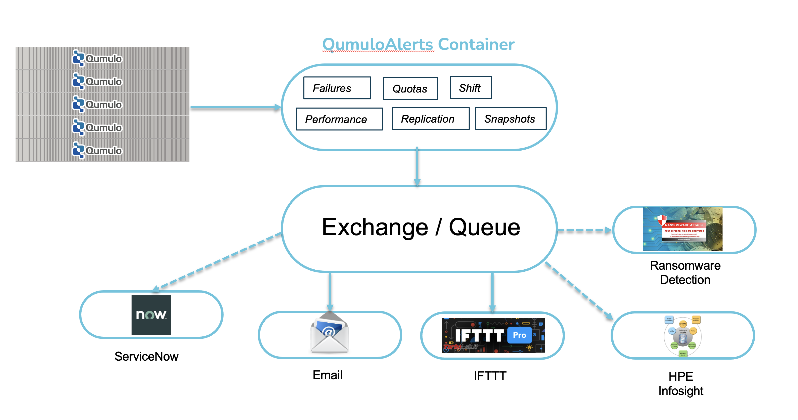

# QumuloAlerts

# This software is in PRE-Alpha state and should not yet be deployed.

## Table of Contents

   * [Introduction](#introduction)
   * [Overview](#overview)
   * [QumuloAlerts](#qumuloalerts)
   * [Exchange](#exchange)
   * [Consumers](#consumers)
   * [Getting Started](#getting-started)
   * [Configuration](#configuration)
   * [Configuring Docker Execution](#configuring-docker-execution)
   * [Why Docker?](#why-docker)
   * [Additional Documentation](#additional-documentation)
   * [Help](#help)
   * [Copyright](#copyright)
   * [License](#license)
   * [Trademarks](#trademarks)
   * [Contributors](#contributors)

## Introduction

Collect Alarms from the hardware and Alerts from the software of one or more Qumulo clusters.

QumuloAlerts is an entire infrastructure, composed of multiple processes that provide the services.
At a minimum, there are always two processes. The first is "alerts"; which communicates with
one or more clusters. The information gathered is sent to the second process; called the "exchange".

Ultimately, the exhange will pass messages onto "consumer" or "subscriber" processes; which will filter, process, and output or store the messages.

Each of the components will be described in more detail below.

## Overview

Let's start with a picture of the the entire infrastructure.



## QumuloAlerts

QumuloAlerts, also called "alerts", is a docker container that collects alarms, alerts, and various other information from one or more Qumulo clusters and passes that information to an exchange (described below).

### Data Collected

All data is collected through individual plugins. There are three classifications of plugins; Alarms, Alerts, and Informational.

#### Alarms

Alarms are classified as hardware changes within a Qumulo cluster. The following list is just a sample of the Alarms collected. We may, in the future, collect more than listed below.

- Node Failure
- Disk Failure
- Power Supply Failure
- Fan Failure
- Network Interface Failure

#### Alerts

Alerts are classified as software or environmental changes within that same Qumulo cluster. The following list is just a sample of the Alerts collected. We may, in the future, add more alerts to those listed below.

- Quota Notification(s) - Done by configured percentage
- Snapshot Creation
- Snapshot Deletion
- Snapshot rate of change too high over a specified period of time (Used for RansomWare detection)
- Volume Notification - Done by configured percentage
- Replication Failure

#### Informational

Informational data is classified as any data on a Qumulo cluster that is not a hardware or software/environmental change.

Example data that is informational might be, but is not limited to:

- Throughput
- IOPS
- Latency
- Directory growth over a given period of time
- OS Version changes

## Exchange

The Exchange is a docker container that facilitates the handling of the messages generated by QumuloAlerts ("alerts"). The
reader should think of the exchange like you would an old fashioned telephone operator. In the past, before dial telephones, when somebody wanted to make a telephone call, you would tell the operator who you wanted to speak with. The operator would setup a connection between
the two parties; the caller and "the called". 

Our exchange is a process that takes messages from alerts and passes them to processes that will consume them. We haven't talked about
the consumers yet, but clearly there must be a method to notify any given group of users that something has happened on their cluster.
Those processes, described below, are broadly called consumers (because they consume the messages passed by the alerts process). 

## Consumers

A consumer (or subscriber) process accepts a message from the Exchange and provides some further filtering and processing of that message. Once processed, the message is either stored, forwarded to another process for additional work, or sent directly to a user in the form of an email or SMS/Webhook message.

## Getting Started

Before you can configure and get this software to work on your system, you will need to clone this repository on your
machine. For that, you will need to have `git` installed on your machine.

Once git is operational, then find or create a directory where you wish to store the contents of the `QumuloAlerts` repository and
clone it to your machine with the command `git clone https://github.com/Qumulo/QumuloAlerts.git`

You will notice that the `git clone` command will create a new directory in your current location call `QumuloAlerts`.

The contents of that directory should look like:

```
drwxr-xr-x  10 someone  somegroup       320 Aug  4 13:09 Docs
-rw-r--r--   1 someone  somegroup      1063 Aug  2 13:23 LICENSE
-rw-r--r--   1 someone  somegroup      5170 Aug  4 12:05 README.md
drwxr-xr-x   4 someone  somegroup       128 Aug  3 17:43 config
-rw-r--r--   1 someone  somegroup       994 Aug  4 13:09 docker-compose.yml
-rw-r--r--   1 someone  somegroup       966 Aug  4 13:09 start-docker-qumuloalerts.ps1
-rwxr-xr-x   1 someone  somegroup       515 Aug  4 13:09 start-docker-qumuloalerts.sh
-rw-r--r--   1 someone  somegroup       557 Aug  2 13:23 stop-docker-qumuloalerts.ps1
-rwxr-xr-x   1 someone  somegroup       301 Aug  2 13:23 stop-docker-qumuloalerts.sh
-rw-r--r--   1 someone  somegroup   7043872 Aug  4 13:09 test_email.macos-latest
-rw-r--r--   1 someone  somegroup  14714824 Aug  2 13:23 test_email.ubuntu-latest

```

Of course, the owner will not be `someone` and the group will not be `somegroup`, but will show you as the owner and the group as whatever group you currently belong to. If in doubt, simply type `id -gn` to see your current group and `id -un` to see your current login id.

You will need to modify several configuration files and one shell script to get this software to run in your environment. Additionally, git doesn't preserve execution permissions, so you will need to add the execution permissions to the files ``test_email.macos-latest``` and ```test_email.ubuntu-latest```.

You can accomplish this by running the command ```chmod a+x test_email.*```

Now, let's move onto editing the configuration files.

## Configuration

You will need to configure several files in order to get QumuloAlerts working properly. There are two groups of configuration files; one for the QumuloAlerts (alerts) and the other for each one of the consumers (email and IFTTT).

Start by looking within the ```config``` directory. You should see:

```
drwxr-xr-x  12 someone  somegroup  384 Aug  4 13:09 consumer
drwxr-xr-x   7 someone  somegroup  224 Aug  4 13:09 alerts
```

### QumuloAlerts (alerts) configuration


## Configuring Docker Execution

in your cloned git directory, you will find a file called "start-docker-qumuloalerts.sh" if you are using a Linux system or "start-docker-qumuloalerts.ps1" if you are on a Windows system. Using your favorite text based editor, edit either file and look at the following four lines.

*LINUX*

```
export QUMULOALERTS_VERSION=0.6.1
export ALERTS_CONFIGDIR=$(pwd)/config/alerts/
export CONSUMER_CONFIGDIR=$(pwd)/config/consumer/
```

*WINDOWS*
```
$env:QUMULOALERTS_VERSION = "0.6.1"
$env:ALERTS_CONFIGDIR = "./config/alerts/"
$env:CONSUMER_CONFIGDIR = "./config/consumer/"
```

You will want to change the first line `QUMULOALERTS_VERSION` to match the major version of the code you are running on your cluster. The reason for this is that we bind the appropriate Qumulo API library for that version in the docker image. If you use a newer docker image than your cluster os version, then you might have an issue where the Qumulo API library cannot connect to the cluster. We only care about the major number of the cluster os version. So if you are running Qumulo Core 5.2.4, then you would set the `QUMULOALERTS_VERSION` to `5.2`. **NOTE** For the preview releases of QumuloAlerts, please only use the VERSION specified and do not modify it. The software has only been tested to this version.

You can leave the entry `ALERTS_CONFIGDIR` and `CONSUMER_CONFIGDIR` alone. This is the location where the configuration and schema files are located. They are used by the docker image for the required values located in those configuration files.

## Running QumuloAlerts in Docker

Once you have edited the files in ```start-docker-qumuloalerts.sh``` (Linux) or ```start-docker-qumuloalerts.ps1``` (Windows), you can execute it by typing ```./start-docker-qumuloalerts.sh``` or ```.\start-docker-qumuloalerts.ps1```. This command will communicate with docker hub to get the image and your local docker system to create the container and start it executing. 

## Stopping QumuloAlerts

Stopping QumuloAlerts requires telling docker to stop the containers. This is done through the script ```stop-docker-qumuloalerts.sh``` (Linux) or ```stop-docker-qumuloalerts.ps1``` (Windows). You execute it by typing ```./stop-docker-qumulolalerts.sh``` or ```.\stop-docker-qumuloalerts.ps1```.

## Why Docker?

Docker is a tool designed to make it easier to create, deploy, and run applications by using containers. Containers allow a developer to package up an application with all of the parts it needs, such as libraries and other dependencies, and ship it all out as one package. By doing so, thanks to the container, the developer of the application can rest assured that the application will run on any machine regardless of any customized settings that machine might have that could differ from the machine used for writing and testing of the application.

In a VERY small way, Docker is like a virtual machine. However, unlike a virtual machine, Docker allows applications to use the same kernel as the system that Docker is running on and only requires applications be shipped with things not already running on the host computer. This gives a significant performance boot and reduces the size of the application by removing the overhead of loading and managing a complete guest OS.

### Docker with Windows

Docker for Windows was initially released in 2013. Since Docker relies on the native features of the operating system and is not a complete virtual environment, developers using Docker had to build images for both Linux and Windows.

This created a lot of headaches for developers because they had to create two different build and test environments. 

In 2016, Microsoft realized that they needed a solution to make Docker (indeed all containerization solutions) easier to develop and implement. In August of 2016, Microsoft released the first implementation of WSL (Windows Subsystem for Linux). WSL allowed Windows to load a simple Linux environment as a Hyper-V guest. This one single Hyper-V could provide all of the underlying Linux features that Docker required; regardless of how many containers were being run.

In June of 2019, WSL2 was released and  was a vast improvement on WSL; mainly in terms of performance and giving users the capability of loading any Linux version that they required (RedHat, CentOS, Ubuntu, etc).

Because of the success of WSL2, Docker will no longer load without WSL2 being installed on your Windows system. 

This was a huge win for Docker developers as it meant that they could create only Linux implementations of their applications and they would run on Linux, Mac, and Windows system with no modifications.

### Configure the Docker Engine to run in your environment

If you do not have Docker already running in your environment, We have taken the guess work out
of getting Docker installed and running on either a virtual or physical machine.

Please follow the instructions under [Additional Documentation](#addition-documentation) in order
to install Docker for your environment.

## Additional Documentation

For help planning the deployment see the table of documents below.

|Documentation|Description|
|-------------|-----------|
|[Installing Docker on Ubuntu](./docs/docker-ubuntu-readme.md) | Details on docker installation on Ubuntu|
|[Installing Docker on Windows](https://docs.docker.com/desktop/windows/install) | Details on docker installation on Windows|

## Help

To post feedback, submit feature ideas, or report bugs, use the [Issues](https://github.com/Qumulo/QumuloAlerts/issues) section of this GitHub repo.

## Copyright

Copyright © 2022 [Qumulo, Inc.](https://qumulo.com)

## License

[](https://opensource.org/licenses/MIT)

See [LICENSE](LICENSE) for full details

    MIT License
    
    Copyright (c) 2022 Qumulo, Inc.
    
    Permission is hereby granted, free of charge, to any person obtaining a copy
    of this software and associated documentation files (the "Software"), to deal
    in the Software without restriction, including without limitation the rights
    to use, copy, modify, merge, publish, distribute, sublicense, and/or sell
    copies of the Software, and to permit persons to whom the Software is
    furnished to do so, subject to the following conditions:
    
    The above copyright notice and this permission notice shall be included in all
    copies or substantial portions of the Software.
    
    THE SOFTWARE IS PROVIDED "AS IS", WITHOUT WARRANTY OF ANY KIND, EXPRESS OR
    IMPLIED, INCLUDING BUT NOT LIMITED TO THE WARRANTIES OF MERCHANTABILITY,
    FITNESS FOR A PARTICULAR PURPOSE AND NONINFRINGEMENT. IN NO EVENT SHALL THE
    AUTHORS OR COPYRIGHT HOLDERS BE LIABLE FOR ANY CLAIM, DAMAGES OR OTHER
    LIABILITY, WHETHER IN AN ACTION OF CONTRACT, TORT OR OTHERWISE, ARISING FROM,
    OUT OF OR IN CONNECTION WITH THE SOFTWARE OR THE USE OR OTHER DEALINGS IN THE
    SOFTWARE.

## Trademarks

All other trademarks referenced herein are the property of their respective owners.

## Contributors

 - [Berat Ulualan](https://github.com/beratulualan)
 - [Michael Kade](https://github.com/mikekade)
